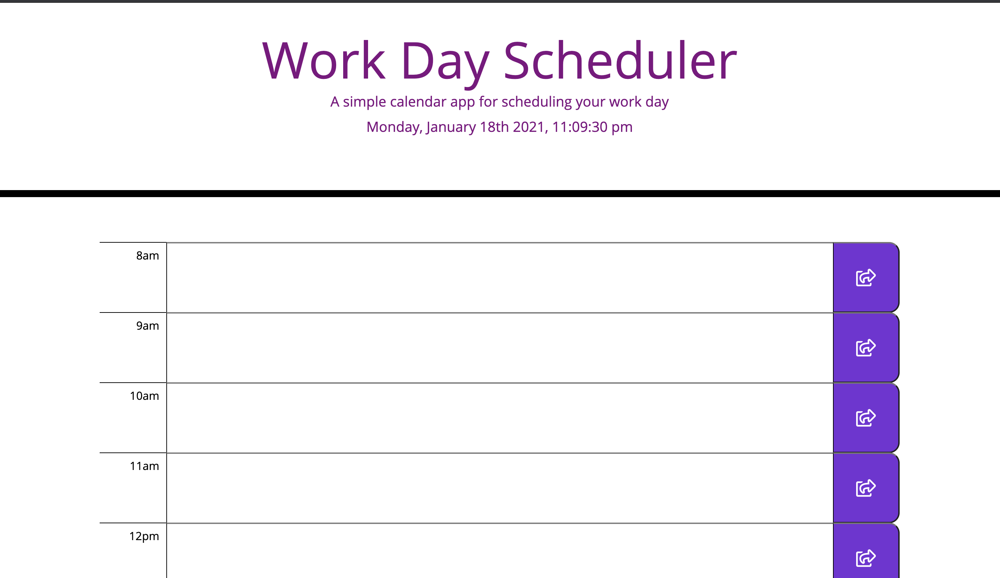

# Daily_scheduler_api

---
> This exercise gave me the opportunity to learn more about the Javascript, DOM, JSON, JQuery.

---
## Goal of this exercise
**To be to create a daily planner/scheduler**
- That the current date,  day and time is displayed at the top of the scheduler.
- That the user can put his/her schedule/things to do at the provided time blocks.
- That the time block is color-coded to indicate if the event is past, present or future.
- That the event that was created  is saved in the local storage.

---
## Javascript
- Learned the use of variable, functions, arrays, conditional statements, console logs, for loop, event listener events.

----
## Link of the timed quiz in Github

- Link [https://joannejavillo.github.io/daily_scheduler_api/]
---
## Screenshots of The Timed Quiz

- image of the scheduler/planner

## Made By JJavillo @ 2021